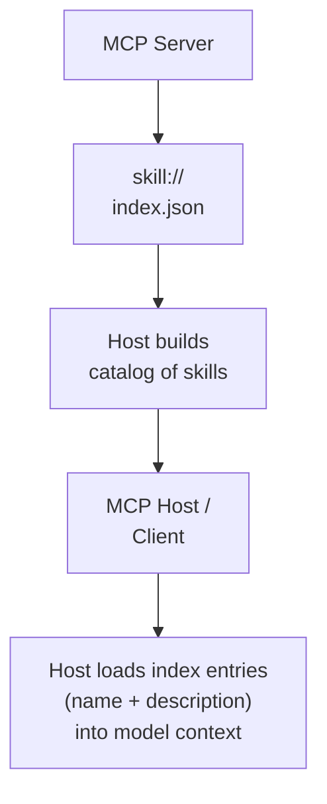

# Implementing Skills-over-MCP in a MCP Host Application (a.k.a. MCP Client)

> Skills Extension SEP draft: [modelcontextprotocol/experimental-ext-skills#69](https://github.com/modelcontextprotocol/experimental-ext-skills/pull/69).
> Note that this link will change in future versions.

Two concerns determine how a host integrates skills over MCP: how it discovers what's available, and how it loads content when the model needs it.

## How the host discovers agent skills from an MCP Server

The model sees skill names and descriptions in its context via the Discovery flow above. How the skill body reaches the model depends on the host's loading strategy. Hosts that load eagerly (either to memory or to disk) place skill content so it's available before the model needs it — the model interacts with it the same way it interacts with any other skill. Hosts that load lazily expose a `read_resource` tool the model invokes with the skill's URI when the task calls for it. In both cases, the model-facing behavior (i.e. frontmatter visible in context, relative paths resolving to supporting files) is identical.

## How the host application + model loads the skill content

|       | In-memory                                   | Materialized to FS                                             |
| :---- | :------------------------------------------ | :------------------------------------------------------------- |
| Lazy  | Lazy in-memory (e.g. using `read_resource`) | Lazy to filesystem (e.g. large archive unpacked on first request) |
| Eager | Eager in-memory (prefetch all on startup)   | Eager to filesystem (writes full catalog to disk at startup)   |

Note: Relative-path resolution within a skill MUST be consistent across all options.

## Implementation gotchas

**Schemes other than `skill://`.** The SEP makes `skill://` a SHOULD, not a MUST. Servers MAY publish skills under any URI scheme (`github://`, `repo://`, etc.) provided each is listed in `skill://index.json`. Hosts that gate their MCP read path on a literal `skill://` prefix (`if uri.startswith("skill://")`) will silently misroute domain-native URIs to the local filesystem reader, where they're typically `Path()`-resolved into a meaningless relative path under cwd. The host's read tool MUST dispatch any URI shape (`<scheme>://...`) through the MCP aggregator if the URI descends from a discovered manifest's root. Detect URIs by the `<scheme>://` shape, not by literal scheme prefix.

**Server name in the model's context.** If the host's read tool takes `(server, uri)` (matching the SEP's illustrative `read_resource` signature), the model has to write the server name on each call. The TS SDK's e2e demo found that without the server name visibly placed in the skill catalog block, model first-call activation fell from ~90% to ~33% — the model either hallucinated the wrong server name or skipped the call entirely. Two ways out: (1) inject the server name into each catalog entry (e.g. `<server>{name}</server>`) so the model has it in context to copy, or (2) drop the `server` argument from the tool entirely and resolve the server host-side from the URI's known origin at discovery time. (2) avoids the failure mode by construction but assumes URIs are unique across connected servers.

## Reuse your existing resource-read tool

If the host already exposes a model-facing resource-read tool, it should in theory needs **zero** changes to support skills — the SEP is a transport binding and skills are just resources. Keep skill-specific guidance in the activated-skill output, not in the tool description.

---

## References

- [SEP draft — experimental-ext-skills#69](https://github.com/modelcontextprotocol/experimental-ext-skills/pull/69)
- [Skill URI Scheme](https://github.com/modelcontextprotocol/experimental-ext-skills/blob/main/docs/skill-uri-scheme.md)
- [Decisions log](https://github.com/modelcontextprotocol/experimental-ext-skills/blob/main/docs/decisions.md)
- [Agent Skills specification](https://agentskills.io/specification)
- [Well-known URI discovery index](https://agentskills.io/well-known-uri)
