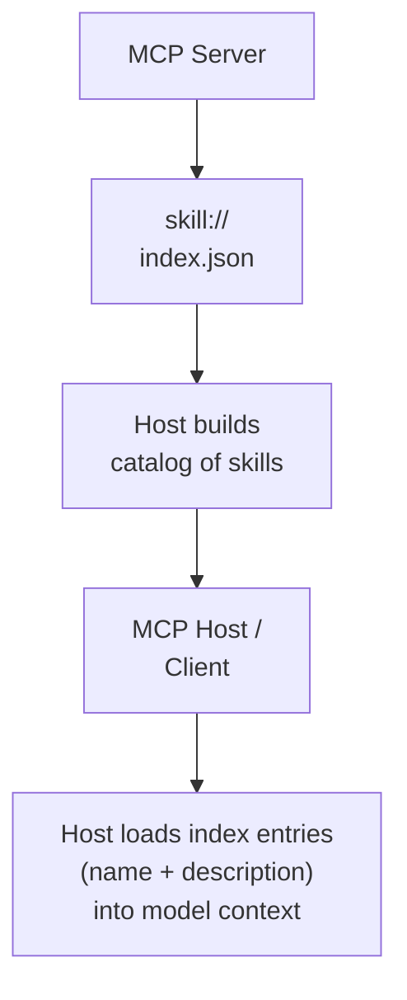

# Implementing Skills-over-MCP in a MCP Host Application (a.k.a. MCP Client)

> Skills Extension SEP: [SEP-2640](https://github.com/modelcontextprotocol/modelcontextprotocol/pull/2640).

Two concerns determine how a host integrates skills over MCP: how it discovers what's available, and how it loads content when the model needs it.

## How the host discovers agent skills from an MCP Server

A host knows a connected server serves skills via the `io.modelcontextprotocol/skills` capability declared in that server's `initialize` response (per [SEP-2133](https://github.com/modelcontextprotocol/modelcontextprotocol/pull/2133) extension negotiation). From there, three discovery paths feed the host's skill catalog:

1. **`skill://index.json`** — the server enumerates its skills (the path shown in the diagram below).
2. **Server `instructions`** — the server's instructions string can name specific skill URIs, which become readable without any catalog round trip.
3. **Direct `resources/read`** — any `skill://` URI is a valid argument to `resources/read` whether or not it appears in any index. A URI handed to the model by the user, by another skill, or by server instructions is readable. **Hosts MUST NOT treat an absent or empty `skill://index.json` as proof a server has no skills** — documentation servers, gateways, and template-generated catalogs are unenumerable by design.

The model sees skill names and descriptions in its context via the Discovery flow above. How the skill body reaches the model depends on the host's loading strategy. Hosts that load eagerly (either to memory or to disk) place skill content so it's available before the model needs it — the model interacts with it the same way it interacts with any other skill. Hosts that load lazily expose a `read_resource` tool the model invokes with the skill's URI when the task calls for it. In both cases, the model-facing behavior (i.e. frontmatter visible in context, relative paths resolving to supporting files) is identical.

## How the host application + model loads the skill content

The host assembles a single internal **registry** of every enabled skill, regardless of origin: filesystem directories and `skill://`-served catalogs from each connected server. Each entry records `name`, `description`, and origin (the local directory, or the `(server, SKILL.md URI)` pair). The model sees only `name` + `description` in context — the same merged list it already sees for filesystem skills, with MCP-served entries mixed in. Origin is host bookkeeping; it is not exposed to the model.

A **name-keyed loader tool** (typically called `read_skill`) is the model's entry point. The host looks the name up in the registry and routes on origin: filesystem skills are read from disk, MCP skills are fetched via `resources/read` against the originating server. From the model's perspective the two are indistinguishable. Once a `SKILL.md` is in context, the model resolves any relative reference (`references/GUIDE.md`, `scripts/extract.py`) **against the skill's root — the directory containing `SKILL.md`, not the `skill://` scheme root**. So `references/GUIDE.md` referenced from `skill://acme/billing/refunds/SKILL.md` resolves to `skill://acme/billing/refunds/references/GUIDE.md`. For MCP skills the host fetches that via a general-purpose `read_resource` tool (or by mounting the server's `skill://` namespace under a virtual filesystem path); for filesystem skills the model reads with the ordinary file-read tool. The resolution rule is identical to filesystem path resolution either way.

Within that model, the host has freedom in *when* it materializes content:

|       | In-memory                                   | Materialized to FS                                             |
| :---- | :------------------------------------------ | :------------------------------------------------------------- |
| Lazy  | Lazy in-memory (e.g. using `read_resource`) | Lazy to filesystem (e.g. large archive unpacked on first request) |
| Eager | Eager in-memory (prefetch all on startup)   | Eager to filesystem (writes full catalog to disk at startup)   |

Relative-path resolution MUST be consistent across all four cells.

## Implementation gotchas

**Schemes other than `skill://`.** The SEP makes `skill://` a SHOULD, not a MUST. Servers MAY publish skills under any URI scheme (`github://`, `repo://`, etc.) provided each is listed in `skill://index.json`. Hosts that gate their MCP read path on a literal `skill://` prefix (`if uri.startswith("skill://")`) will silently misroute domain-native URIs to the local filesystem reader, where they're typically `Path()`-resolved into a meaningless relative path under cwd. The host's read tool MUST dispatch any URI shape (`<scheme>://...`) through the MCP aggregator if the URI descends from a discovered manifest's root. Detect URIs by the `<scheme>://` shape, not by literal scheme prefix.

**Server name in the model's context.** If the host's read tool takes `(server, uri)` (matching the SEP's illustrative `read_resource` signature), the model has to write the server name on each call. The TS SDK's e2e demo found that without the server name visibly placed in the skill catalog block, model first-call activation fell from ~90% to ~33% — the model either hallucinated the wrong server name or skipped the call entirely. Two ways out: (1) inject the server name into each catalog entry (e.g. `<server>{name}</server>`) so the model has it in context to copy, or (2) drop the `server` argument from the tool entirely and resolve the server host-side from the URI's known origin at discovery time. (2) avoids the failure mode by construction but assumes URIs are unique across connected servers.

**Archive index entries.** A host that walks only `type: "skill-md"` entries will silently drop skills declared as `type: "archive"` (a single archive resource that unpacks to the skill directory). Hosts MUST handle both. For archives: support both `.tar.gz` and `.zip`, determining format from the resource's `mimeType` (`application/gzip` or `application/zip`) and falling back to the URL suffix; derive the skill's namespace by stripping the archive suffix from the entry's `url` (`skill://pdf-processing.tar.gz` → `skill://pdf-processing/`); apply archive-safety validation — reject path traversal (`..`), absolute paths, links resolving outside the skill directory, and bound total unpacked size to defend against decompression bombs. After unpacking, files are addressable as `skill://<skill-path>/<file-path>` exactly as they would be under individual-resource distribution; the model-facing namespace is identical.

**Template index entries.** The third index `type` is `"mcp-resource-template"` — a parameterized URI like `skill://docs/{product}/SKILL.md` that describes an unbounded skill namespace without enumerating it. Hosts that ignore unrecognized types are spec-conformant (clients SHOULD skip unknown `type` values) but lose the discovery surface for these servers entirely. To support them, register the template `url` as an MCP resource template and wire its variables to the [completion API](https://modelcontextprotocol.io/specification/2025-11-25/server/utilities/completion) so the user can fill them in interactively; the resolved URI is then read like any other `skill://` URI. The `name` field is omitted on template entries because the name isn't determined until variables are bound.

## Security posture for skill content

Skill bodies are model-facing instructional text supplied by a connected server. Apply MCP's standard untrusted-input defenses, plus:

**No implicit local execution.** Filesystem-sourced skills may declare hooks, pre/post-invocation scripts, or shell commands in frontmatter — mechanisms some hosts honor because the user authored or installed the skill themselves. When a skill arrives over MCP, the host MUST NOT silently honor any such mechanism. Either ignore those fields entirely, or gate them behind explicit per-skill user approval that names what will execute and where. Silent execution of server-provided directives because they appeared in a `SKILL.md` is a remote-code-execution vector. (Archive safety, covered under *Archive index entries* above, is the related unpacking attack surface.)

**Data, not directives.** Skill content carries no higher authority than other context. Whether to load a skill at all is user policy, not server fiat.

**Provenance and inspection.** Show which server a skill came from when surfacing it to the user. Let users inspect skill content before it is loaded into model context. Per-skill / per-server enable/disable is recommended; loading a skill MAY be gated behind explicit user approval.

**Not a third-party marketplace.** This extension is for servers shipping skills that describe their *own* tools, not for relaying arbitrary third-party content through a connected server. The trust boundary is the connected server.

## Reuse your existing resource-read tool

If the host already exposes a model-facing resource-read tool, that tool itself in theory needs **zero** changes to support skills — the SEP is a transport binding and skills are just resources. The skill-specific work is in the registry, the catalog surfacing, and the security posture above; the read tool stays generic. Keep skill-specific guidance in the activated-skill output, not in the read tool's description.

---

## References

- [SEP-2640 — Skills Extension](https://github.com/modelcontextprotocol/modelcontextprotocol/pull/2640)
- [Skill URI Scheme](https://github.com/modelcontextprotocol/experimental-ext-skills/blob/main/docs/skill-uri-scheme.md)
- [Decisions log](https://github.com/modelcontextprotocol/experimental-ext-skills/blob/main/docs/decisions.md)
- [Agent Skills specification](https://agentskills.io/specification)
- [Well-known URI discovery index](https://agentskills.io/well-known-uri)
