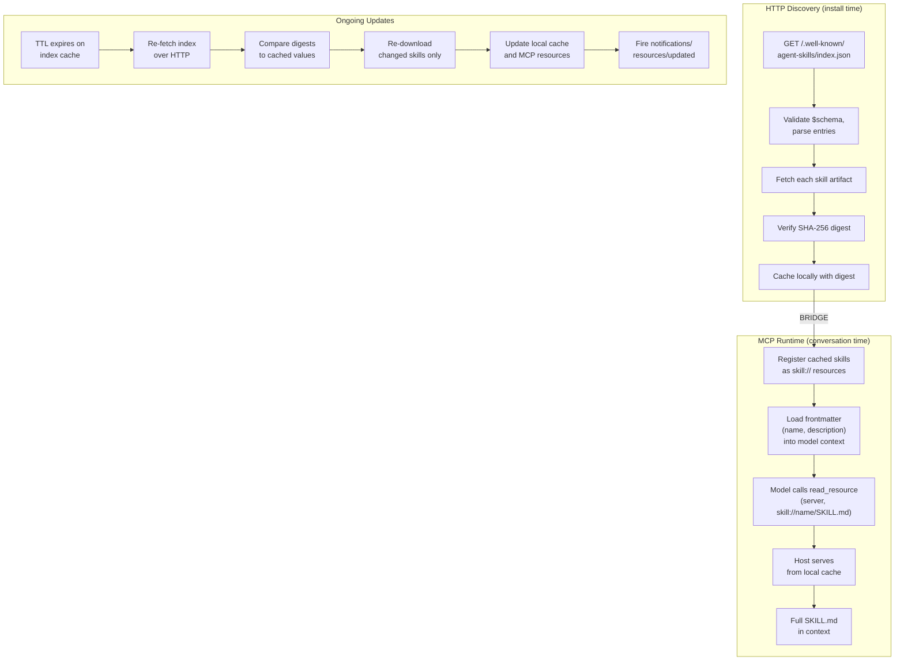

# @modelcontextprotocol/ext-skills

TypeScript SDK for the [Skills Extension SEP](https://github.com/modelcontextprotocol/experimental-ext-skills/pull/69) — serves agent skills as `skill://` resources over MCP.

> **Experimental.** Published as [`@olaservo/ext-skills`](https://www.npmjs.com/package/@olaservo/ext-skills) for testing while the spec is in draft.

## Install

```bash
npm install @olaservo/ext-skills @modelcontextprotocol/sdk
```

## Subpath exports

| Import path | Purpose |
|---|---|
| `@olaservo/ext-skills` | Shared types, URI utilities, constants |
| `@olaservo/ext-skills/server` | Server-side: discover skills, register MCP resources |
| `@olaservo/ext-skills/client` | Client-side: list skills, read content, build summaries |
| `@olaservo/ext-skills/well-known` | HTTP bridge: fetch skills from `/.well-known/agent-skills/` |

## Server usage

Discover skills from a directory of `SKILL.md` files and serve them as MCP resources:

```typescript
import { McpServer } from "@modelcontextprotocol/sdk/server/mcp.js";
import { StdioServerTransport } from "@modelcontextprotocol/sdk/server/stdio.js";
import {
  discoverSkills,
  registerSkillResources,
  declareSkillsExtension,
} from "@olaservo/ext-skills/server";

// Recursively scan a directory for SKILL.md files
const skillMap = discoverSkills("./skills");

// Create server and declare the skills extension (SEP-2133)
const server = new McpServer(
  { name: "my-server", version: "1.0.0" },
  { capabilities: { resources: {} } },
);
declareSkillsExtension(server.server);

// Register all skill resources (SKILL.md, manifests, index, templates)
registerSkillResources(server, skillMap, "./skills", {
  template: true,    // enable resource template for supporting files
  promptXml: true,   // enable skill://prompt-xml convenience resource
  // audience defaults to ["assistant"] — skills consumed only by the model
  // use ["user", "assistant"] for skills also shown in a skill browser UI
});

await server.connect(new StdioServerTransport());
```

### Skill directory structure

```
skills/
  code-review/
    SKILL.md                    # Required: YAML frontmatter + markdown body
    references/
      REFERENCE.md              # Optional: supporting files
  acme/billing/refunds/
    SKILL.md                    # Multi-segment paths supported
    templates/
      refund-email-template.md
```

Each `SKILL.md` requires YAML frontmatter with `name` and `description`:

```yaml
---
name: code-review
description: Review code changes for quality and correctness
---

# Code Review

Instructions for the agent...
```

### Registered resources

For each skill, the server registers:

- `skill://{skillPath}/SKILL.md` -- skill content
- `skill://{skillPath}/_manifest` -- file manifest with SHA-256 hashes
- `skill://index.json` -- discovery index (all skills)
- `skill://{+skillFilePath}` -- resource template for supporting files (optional)
- `skill://prompt-xml` -- XML summary for system prompt injection (optional)

### Resource annotations

All resources include `annotations` with `audience`, `priority`, and `lastModified` (see [`skill-meta-keys.md`](../../docs/skill-meta-keys.md)):

- **`audience`** defaults to `["assistant"]`. Override globally via options, or per-skill via `SkillMetadata.audience`:

```typescript
// Global default for all skills
registerSkillResources(server, skillMap, "./skills", {
  audience: ["user", "assistant"],
});

// Per-skill override (e.g., set from frontmatter or config)
const skillMap = discoverSkills("./skills");
for (const skill of skillMap.values()) {
  skill.audience = ["user", "assistant"];
}
```

- **`priority`** is set per resource type: 1.0 (SKILL.md), 0.8 (index), 0.5 (manifest), 0.3 (prompt-xml), 0.2 (supporting files)
- **`lastModified`** uses per-skill mtime for SKILL.md and manifest resources, and the most recent mtime across all skills for aggregate resources (index, template, prompt-xml)
- **`size`** is set on all resources except the template (which varies per request)

### Resource templates in the index

Servers with parameterized skill namespaces can include `mcp-resource-template` entries in the discovery index:

```typescript
import { generateSkillIndex } from "@olaservo/ext-skills/server";

const index = generateSkillIndex(skillMap, [
  {
    name: "docs",
    description: "Product documentation",
    uriTemplate: "skill://docs/{product}/SKILL.md",
  },
]);
```

## Client usage

### Quick start

Discover skills and build a system prompt catalog in one call:

```typescript
import { discoverAndBuildCatalog } from "@olaservo/ext-skills/client";

const { skills, catalog } = await discoverAndBuildCatalog(client, {
  serverName: "my-skills-server",
});

console.log(`Discovered ${skills.length} skill(s)`);
// Inject `catalog` into your agent's system prompt
```

`discoverAndBuildCatalog()` handles the recommended discovery strategy (try `skill://index.json` first, fall back to `resources/list`) and builds an XML catalog with behavioral instructions for the model. The `serverName` is required — including it raises model activation reliability from ~33% to ~90%.

### Step by step

For more control, use the lower-level functions directly:

```typescript
import {
  discoverSkills,
  listSkillsFromIndex,
  listSkillTemplatesFromIndex,
  readSkillUri,
  readSkillContent,
  readSkillManifest,
  readSkillDocument,
  buildSkillsCatalog,
  buildSkillsSummary,
  READ_RESOURCE_TOOL,
} from "@olaservo/ext-skills/client";

// Discover skills (index-first with fallback, always returns an array)
const skills = await discoverSkills(client);

// Or use specific discovery mechanisms:
const indexSkills = await listSkillsFromIndex(client);   // skill://index.json (returns null if unavailable)
const templates = await listSkillTemplatesFromIndex(client); // mcp-resource-template entries

// Read skill content by URI (works with any scheme: skill://, repo://, github://, etc.)
const content = await readSkillUri(client, skill.uri);

// Or by skill path (convenience, skill:// scheme only)
const md = await readSkillContent(client, "acme/billing/refunds");

// Read file manifest (SHA-256 hashes for each file)
const manifest = await readSkillManifest(client, "code-review");

// Read a supporting file
const doc = await readSkillDocument(client, "acme/billing/refunds", "templates/refund-email-template.md");

// Build catalog or summary for context injection
const catalog = buildSkillsCatalog(skills, { toolName: "read_resource", serverName: "my-server" });
const summary = buildSkillsSummary(skills);

// READ_RESOURCE_TOOL — tool schema for model-driven skill loading
// Hosts expose this so the model can call read_resource(server, uri)
console.log(READ_RESOURCE_TOOL);
```

### Scheme-agnostic discovery

Per the SEP, `skill://` is SHOULD, not MUST. Servers may serve skills under any URI scheme (e.g., `repo://`, `github://`) provided they are listed in `skill://index.json`. The discovery functions (`discoverSkills`, `listSkillsFromIndex`) handle any scheme in index entries, and `readSkillUri()` reads any URI regardless of scheme.

## Well-known HTTP bridge

The bridge connects HTTP-based skill publishing to MCP-based skill serving:



Fetch skills published at `/.well-known/agent-skills/index.json` and cache them locally for serving over MCP:

```typescript
import { fetchFromWellKnown, refreshFromWellKnown } from "@olaservo/ext-skills/well-known";
import { discoverSkills, registerSkillResources } from "@olaservo/ext-skills/server";

// Fetch skills from a domain and cache to a local directory
const result = await fetchFromWellKnown({
  domain: "example.com",
  cacheDir: "./cache/example.com",
});

// result.skills   — fetched skills [{name, skillPath, cached}]
// result.skipped  — entries skipped (templates, unknown types)
// result.errors   — fetch/verification failures

// Feed the cache directory into the existing server pipeline
const skillMap = discoverSkills("./cache/example.com");
registerSkillResources(server, skillMap, "./cache/example.com");

// On subsequent calls, use refreshFromWellKnown to skip unchanged skills
const refresh = await refreshFromWellKnown({
  domain: "example.com",
  cacheDir: "./cache/example.com",
});
// refresh.skills.filter(s => !s.cached) — only changed skills
```

The bridge supports:
- **skill-md** entries: downloads `SKILL.md` directly
- **archive** entries: downloads and extracts `.tar.gz` bundles
- **Digest verification**: SHA-256 integrity checks against the `digest` field
- **Digest caching**: skips re-downloading unchanged skills on refresh
- **URL resolution**: relative, path-absolute, and absolute URLs per RFC 3986

### Try it with a live endpoint

The MCP specification site publishes skills at a well-known endpoint you can test against:

```typescript
const result = await fetchFromWellKnown({
  domain: "modelcontextprotocol.io",
  cacheDir: "./cache/mcp",
});
console.log(result.skills); // skills fetched from the live index
```

Index URL: https://modelcontextprotocol.io/.well-known/agent-skills/index.json

## URI scheme

```
skill://code-review/SKILL.md                     # single-segment path
skill://acme/billing/refunds/SKILL.md            # multi-segment path
skill://acme/billing/refunds/_manifest            # file manifest
skill://acme/billing/refunds/templates/email.md   # supporting file
skill://index.json                                # discovery index
skill://prompt-xml                                # XML summary
```

URI utilities are available from the main import:

```typescript
import { parseSkillUri, buildSkillUri, isSkillContentUri } from "@olaservo/ext-skills";
```

## Related

- [Skills Extension SEP (PR #69)](https://github.com/modelcontextprotocol/experimental-ext-skills/pull/69) -- the spec this implements
- [Skills Over MCP Interest Group](https://github.com/modelcontextprotocol/experimental-ext-skills) -- parent repository
- [Agent Skills well-known URI spec](https://github.com/agentskills/agentskills/pull/254) -- HTTP discovery spec the bridge targets
- [Server example](../../examples/skills-server/typescript/) -- reference MCP server
- [Client example](../../examples/skills-client/typescript/) -- reference MCP client

## License

Apache-2.0
